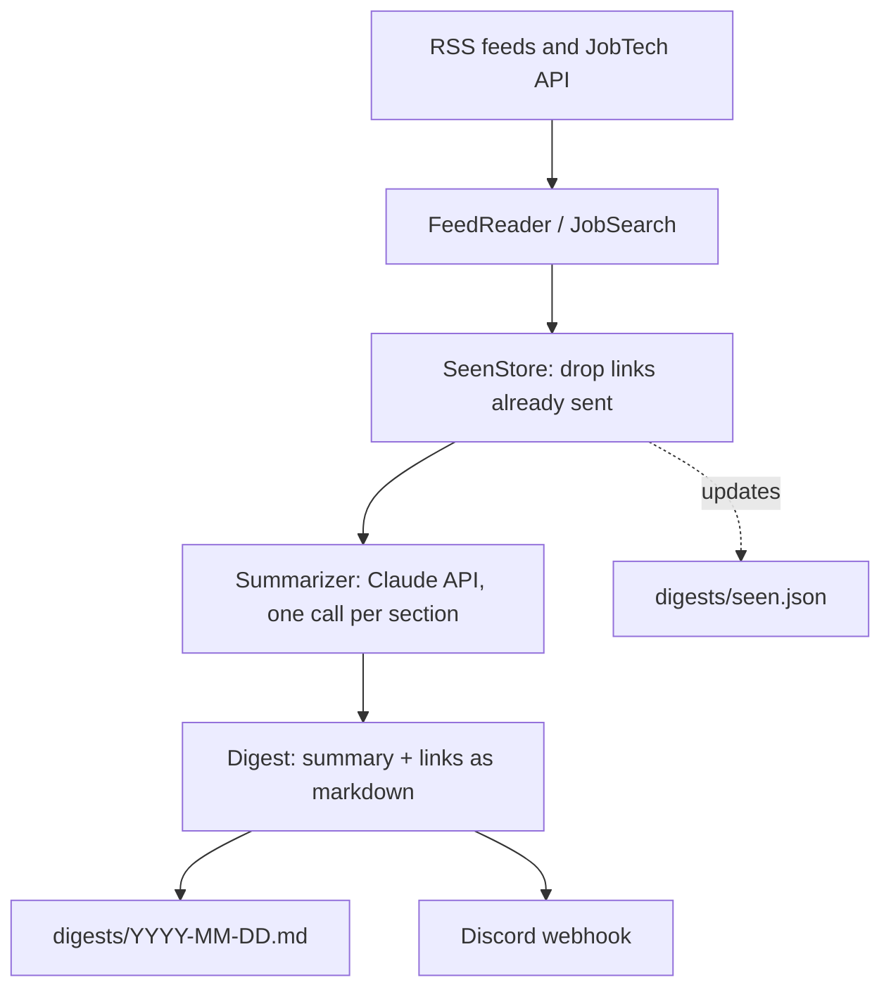

<div align="center">

# dev-digest

**A daily news and job digest, summarized by Claude and delivered to Discord.**


[Overview](#overview) · [How it works](#how-it-works) · [Getting started](#getting-started) · [Configuration](#configuration) · [Design decisions](#design-decisions) · [Limitations](#known-limitations)

</div>

<!-- Add a screenshot of the Discord message here:

-->

## Overview

dev-digest is a .NET console app that runs every morning on GitHub Actions. It collects fresh headlines and job ads from RSS feeds and an open job API, lets Claude write a short summary for each topic, and posts the result to a Discord channel. Every link is delivered exactly once.

Each digest starts with a verse of the day (reference and link), followed by four sections. Each section is a summary followed by the links it is based on:

| Section | Sources | Notes |
|---|---|---|
| **War and conflicts** | Al Jazeera, BBC Middle East, The Guardian | Iran, USA, Israel and Palestine. Mixed perspectives on purpose, filtered by keywords, summarized neutrally with sources attributed |
| **DevOps and software development** | Hacker News, dev.to, CNCF, Docker, Kubernetes, .NET Blog, Azure Blog, GitHub Changelog, PostgreSQL | Tuned for a backend and cloud developer |
| **AI worldwide** | Hacker News, Simon Willison, The Verge, MIT Technology Review | Research, products and commentary |
| **New job ads** | Arbetsförmedlingen JobTech API | Junior .NET, cloud and DevOps roles in Gothenburg |

Illustrative shape of one section (not real output):

```markdown
### AI worldwide

Four to six sentences summarizing the new items in this section...

**Links**
* [Some headline](https://example.com/article) (Source name)
* [Another headline](https://example.com/other) (Another source)
```

## How it works



1. **Collect.** `FeedReader` parses RSS and Atom feeds and applies keyword filters. `JobSearch` queries the JobTech API.
2. **Deduplicate.** `SeenStore` keeps every link already sent in `digests/seen.json` and drops repeats. Entries are forgotten after 120 days so the file stays small.
3. **Summarize.** `Summarizer` sends the new headlines of each section to Claude Haiku 4.5 and gets back a short summary in English.
4. **Deliver.** `Digest` renders the markdown, which is saved to `digests/` and posted to Discord in several messages split on line breaks, so no link is cut in half.
5. **Persist.** The workflow commits the day's digest and `seen.json` back to the repository.

### Project structure

```
dev-digest/
├── .github/workflows/
│   ├── daily-digest.yml      scheduled run, commits the digest
│   └── ci.yml                runs the tests on push and pull requests
├── digests/                  generated: daily markdown, seen.json, badge.json
├── src/DevDigest/
│   ├── Program.cs            orchestration, about 40 lines
│   ├── Config.cs             sources, keywords, per section instructions
│   ├── FeedReader.cs         RSS and Atom parsing, keyword filtering
│   ├── JobSearch.cs          JobTech API client
│   ├── SeenStore.cs          sent-link memory
│   ├── ISummarizer.cs        summarizer contract
│   ├── Summarizer.cs         Claude API implementation
│   ├── Digest.cs             renders one section as markdown
│   ├── VerseOfTheDay.cs      verse of the day from OurManna, with a fallback link
│   ├── Discord.cs            message splitting and delivery
│   └── Models.cs             Item and Feed records
└── tests/DevDigest.Tests/    xUnit tests
```

## Getting started

### Prerequisites

* .NET 10 SDK
* A Discord webhook (channel settings, Integrations, Webhooks)
* An Anthropic API key. Choose a workspace when you create the key, otherwise the API asks for an `anthropic-workspace-id` header on every request

### Run locally

```bash
git clone https://github.com/Megjafari/dev-digest.git
cd dev-digest

export ANTHROPIC_API_KEY="..."
export DISCORD_WEBHOOK="..."        # optional
DRY_RUN=1 dotnet run --project src/DevDigest
```

`DRY_RUN=1` writes to `digests-preview/` and leaves `seen.json` untouched, so local testing never affects what the scheduled run sends. Without `ANTHROPIC_API_KEY` the digest is produced without summaries. Without `DISCORD_WEBHOOK` nothing is posted.

### Deploy on your own fork

1. Fork the repository.
2. Add the secrets and variable listed under [Configuration](#configuration).
3. Under Settings, Actions, General, set Workflow permissions to "Read and write permissions".
4. Run the `daily-digest` workflow once from the Actions tab. After that it runs on its own at 06:00 UTC.

The first run sends everything that is current. After that you only get what is new.

## Configuration

| Name | Type | Required | Purpose |
|---|---|---|---|
| `DISCORD_WEBHOOK` | Secret | For delivery | Where the digest is posted |
| `ANTHROPIC_API_KEY` | Secret | For summaries | Claude API access. Without it the digest contains links only |
| `COMMIT_EMAIL` | Variable | Yes | Your GitHub noreply address. A commit only counts as yours if the email belongs to your account |
| `DRY_RUN` | Env var | No | `1` writes to `digests-preview/` and does not update the seen list |

Sources, keywords, job searches and the per section summarizer instructions all live in `src/DevDigest/Config.cs`.

## Testing

```bash
dotnet test tests/DevDigest.Tests
```

The tests cover the logic that is easiest to get wrong: deduplication and batch limits in `SeenStore`, message splitting in `Discord`, and keyword filtering in `FeedReader`. They run in CI on every push that touches `src/` or `tests/`, and on pull requests.

## Design decisions

* **RSS and open APIs instead of HTML scraping.** More stable, and it avoids terms of service and robots.txt problems.
* **The repository is the storage.** The seen list and the daily archive are plain files committed by the workflow, so the app needs no database and no hosting. The cost is that most of the commit history consists of `digest:` commits.
* **One summary per section, not per article.** Fewer API calls and a briefing that can be read in a minute.
* **Claude only sees headlines and short snippets.** The prompt tells it to use only what is in the list, to ignore instructions hidden in feed content, and, for conflict news, to stay neutral, attribute claims and point out where sources differ.
* **Haiku 4.5.** Short summaries of short inputs do not need a larger model.
* **Graceful degradation.** A failing source is logged and skipped, and a missing or failing Claude API still produces a digest with links.
* **Small files with one job each.** `Program.cs` only orchestrates, and the summarizer sits behind an interface.
* **Verse of the day via OurManna.** BibleGateway returns 403 to scripts, so the verse comes from an API that allows it. Only the reference and a link are included, not the text, since the digests are committed to a public repo.

## Cost

A typical run uses around 2,500 tokens, which is about a cent or less on Claude Haiku 4.5. The badge at the top shows the token count of the latest run. GitHub Actions is free for public repositories, and the RSS feeds, JobTech and Discord webhooks are free.

## Known limitations

* A source that fails, for example with a 403 from a site that blocks bots, is logged and skipped with no retries.
* Summaries are overviews built from headlines and snippets, not deep reads of the articles. The links are there for a reason.
* The verse of the day comes from OurManna, because BibleGateway blocks automated requests. It is not necessarily the same verse BibleGateway shows. If OurManna is unavailable, a plain link to BibleGateway is used instead.
* Scheduled workflows on GitHub can start 5 to 30 minutes late, and the cron time is in UTC, so the local time shifts by an hour when daylight saving time changes.

## License

Released under the [MIT License](LICENSE).